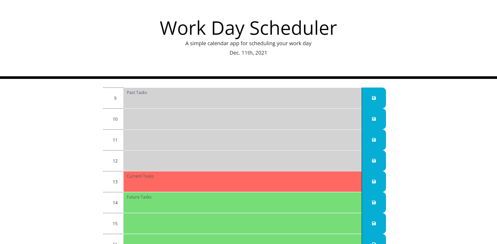

# Work Day Scheduler

  * This is an hourly schedule you can use to keep track of your work throughout the workday.
  * The colors change according to the time of day, grey means the hour has past, salmon pink means that is the current hour, and green means hours ahead.
  * Click on an empty schedule block to add your items you want to track.
  * Save them by clicking the corresponding save button.
  * Your items will continue to display until you save over them.

## Link to application
  * https://craigmjensen.github.io/day-schedule/

## Screenshot
  
